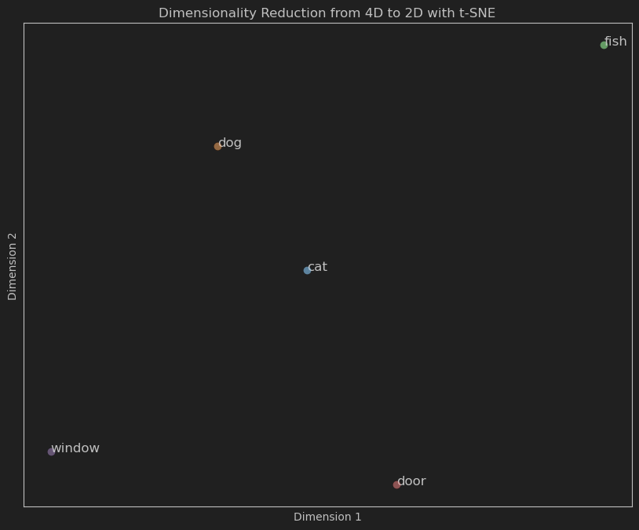

# Word-Embeddings

## One-hot Encoding

Our goal is to find a numeric representation of a word. Now the question is how to represent a word as a number. The most basic way we can do that is with a one-hot encoding.

$$
|V| = 10,000
$$

Note: $|V|$ is the size of our vocabulary; we use brackets to denote cardinality.

Out of 10,000 words, we can represent each word as a vector of 10,000 dimensions. Each word is represented by a vector of 10,000 dimensions.

So if word $w$ is at index $i$, then the vector representation of $w$ is a vector of 10,000 dimensions with all zeros except at index $i$ where it is 1.

$$
w_0 = [1, 0, 0, \ldots, 0]^T
$$

$$
w_1 = [0, 1, 0, \ldots, 0]^T
$$

$$
.
.
.
$$

$$
w_{9999} = [0, 0, 0, \ldots, 1]^T
$$

The matrix representing our vocabulary is called the embedding matrix, and it looks like this:

$$
\begin{equation}
    \text{embedding matrix}_{|V| \times |V|} =
        \begin{bmatrix}
            1 & 0 & 0 & \ldots & 0 \cr
            0 & 1 & 0 & \ldots & 0 \cr
            \vdots & \vdots & \vdots & \ddots & \vdots \cr
            0 & 0 & 0 & \ldots & 1
\end{bmatrix}
\end{equation}
$$

## The Problem with One-hot Encoding

You may think this is a very inefficient way to represent words due to the sparsity and the high dimensionality of the vectors. However, this isn't actually why we are concerned. The actual concern is that one-hot encoding doesn't capture the similarity between words. This is because the Euclidean distance between any two one-hot vectors is the same, and the cosine similarity between any two one-hot vectors is 0.

Let's demonstrate this mathematically:

The Euclidean distance between two vectors $v_i$ and $v_j$ is defined as:

$$
d(v_i, v_j) = \sqrt{\sum_{k=1}^{n} (v_{ik} - v_{jk})^2}
$$

where $v_i$ and $v_j$ are the one-hot vectors of words $w_i$ and $w_j$.

Let's calculate the Euclidean distance between two one-hot vectors $w_0$ and $w_1$:

$$
d(w_0, w_1) = \sqrt{(1-0)^2 + (0-1)^2 + 0 + \ldots + 0} = \sqrt{2}
$$

Similarly, the distance between $w_0$ and $w_{9999}$ is:

$$
d(w_0, w_{9999}) = \sqrt{(1-0)^2 + 0 + \ldots + (0-1)^2} = \sqrt{2}
$$

We have shown that the Euclidean distance between any two one-hot vectors is $\sqrt{2}$. Which isn't very helpful for determining the distance between words.

Now let's calculate the cosine similarity between two one-hot vectors $w_0$ and $w_1$:

$$
cos(v_i, v_j) = \frac{v_i \cdot v_j}{||v_i|| \cdot ||v_j||}
$$

again, where $v_i$ and $v_j$ are the one-hot vectors of words $w_i$ and $w_j$.

$$
cos(w_0, w_1) = \frac{(1 \cdot 0) + (0 \cdot 1) + 0 + \ldots + 0}{\sqrt{1} \cdot \sqrt{1}} = 0
$$

and for $w_0$ and $w_{9999}$ the cosine similarity is:

$$
cos(w_0, w_{9999}) = \frac{(1 \cdot 0) + 0 + \ldots + (0 \cdot 1)}{\sqrt{1} \cdot \sqrt{1}} = 0
$$

We have shown that the cosine similarity between any two one-hot vectors is 0. Which isn't very helpful for determining the similarity between words.

## Feature Representation

The solution to this problem is to represent words as dense vectors. This is where word embeddings come in. The basic idea behind word embeddings is to represent words in a continuous vector space. The basic idea is that similar words will have similar real-valued numbers. This is done by representing each word as a dense vector of a fixed dimensionality. For each dimension, we learn a real-valued number that represents a feature of the word.

This is a dummy example of a word embedding matrix with five words and four features:

$$
\begin{equation}
    \begin{array}{c|cccc}
        & \text{aquatic} & \text{mammal} & \text{size} & \text{color} \\
        \hline
        \text{cat} & 0.1 & 0.9 & 0.4 & 0.4 \\
        \text{dog} & 0.2 & 0.8 & 0.7 & 0.8 \\
        \text{fish} & 0.9 & 0.5 & 0.2 & 0.9 \\
        \text{door} & 0.3 & 0.1 & 0.6 & 0.2 \\
        \text{window} & 0.4 & 0.2 & 0.3 & 0.1
    \end{array}
\end{equation}
$$

We could use dimensionality reduction techniques to reduce the number of features to 2, to create a visual representation of our matrix. We can see that the vectors that are closer to each other are 

### Embedding Techniques

This notebook will cover the following word embedding techniques:
- Word2Vec
- Doc2Vec
- GloVe
- FastText
- ELMo

The main goal of these techniques is to learn dense vector representations of words that capture semantic and syntactic properties. 

### Key Ideas Behind Word Embeddings

1. **Representation of Words in Vector Space:**
   - All these techniques aim to represent words (and sometimes larger text units) as vectors in a continuous vector space. This allows for the capture of semantic relationships and similarities between words.

2. **Capturing Semantic Similarity:**
   - These models are designed to capture semantic similarity between words. Words that are used in similar contexts or have similar meanings end up with similar vector representations.

3. **Dimensionality Reduction:**
   - Each technique reduces the high-dimensional, sparse representation of words (e.g., one-hot encoding) to a lower-dimensional, dense vector representation. This makes the vectors more computationally manageable and useful for various downstream tasks.

4. **Contextual Information:**
   - All these methods use context to some extent to learn word representations. The context can be local (e.g., surrounding words in a sentence) or global (e.g., co-occurrence across a corpus).

5. **Training Objectives:**
   - Each model has a specific training objective designed to optimize the vector representations. Whether it’s predicting words from their context, factorizing a co-occurrence matrix, or more complex objectives like masked language modeling, the goal is to learn vectors that are useful for capturing semantic and syntactic properties.

6. **Handling Large Corpora:**
   - These models are designed to scale to large text corpora. They use various optimization techniques and architectures to efficiently process and learn from massive amounts of text data.

7. **Downstream Task Performance:**
   - The learned embeddings can be used as features for various natural language processing tasks such as text classification, named entity recognition, sentiment analysis, and machine translation. Improved embeddings typically lead to better performance on these tasks.

### High-Level Description of Techniques

1. **Word2Vec, Doc2Vec, and FastText:**
   - **Local Context:** These models focus on predicting words based on their local context within a fixed window.
   - **Neural Network-based:** They use neural network architectures (e.g., shallow feedforward networks) for learning embeddings.
   - **Efficiency:** They are designed for efficient training using techniques like negative sampling and hierarchical softmax.

2. **GloVe:**
   - **Global Context:** Utilizes global word co-occurrence statistics across the entire corpus.
   - **Matrix Factorization:** Factorizes a large sparse matrix constructed from word co-occurrence counts.

3. **ELMo and BERT:**
   - **Deep Contextualized Representations:** These models produce embeddings that are context-dependent, changing based on the sentence they are used in.
   - **Pre-trained Language Models:** Both are pre-trained on large text corpora using unsupervised objectives and can be fine-tuned for specific downstream tasks.
   - **Transformers and LSTMs:** ELMo uses LSTMs, while BERT uses transformer architectures, both capable of capturing long-range dependencies in text.

### Overview Table

| Technique   | Context Type         | Training Objective          | Architecture             | Unique Feature                           |
|-------------|----------------------|-----------------------------|--------------------------|------------------------------------------|
| **Word2Vec**| Local (window-based) | Predict words (CBOW/Skip-gram)| Shallow neural network   | Predictive, efficient for large data     |
| **Doc2Vec** | Local + Document     | Predict words + doc context | Shallow neural network   | Embeds entire documents                  |
| **GloVe**   | Global               | Factorize co-occurrence matrix| Matrix factorization    | Captures global word statistics          |
| **FastText**| Local + Subword      | Predict words (CBOW/Skip-gram)| Shallow neural network   | Handles out-of-vocabulary words          |
| **ELMo**    | Sentence-level       | Language modeling           | Bidirectional LSTM       | Contextualized, deep representations     |
| **BERT**    | Sentence-level       | Masked language modeling    | Transformer              | Bidirectional context, versatile fine-tuning | 

